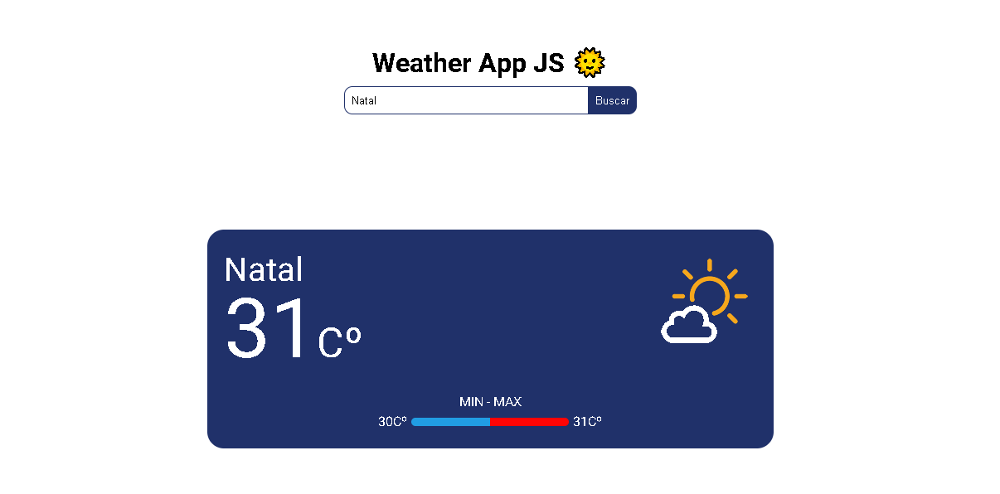
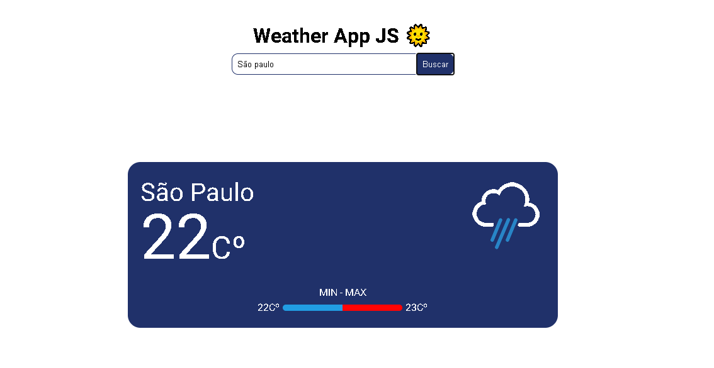
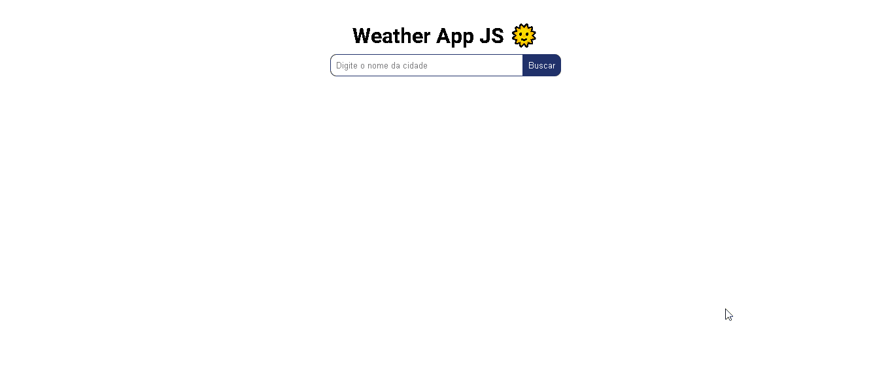

# Weather App JS 🌞

## Sobre: 
Uma simples aplicação web para saber o clima atual da cidade pesquisada, usando uma <a href="https://openweathermap.org/api" target="_blank">Weather API</a>. Basta escrever o nome da cidade e em seguida clicar em "Buscar", a aplicação mostrará a temperatura atual, máxima e mínima do dia.

